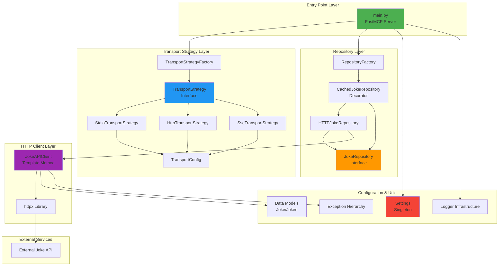
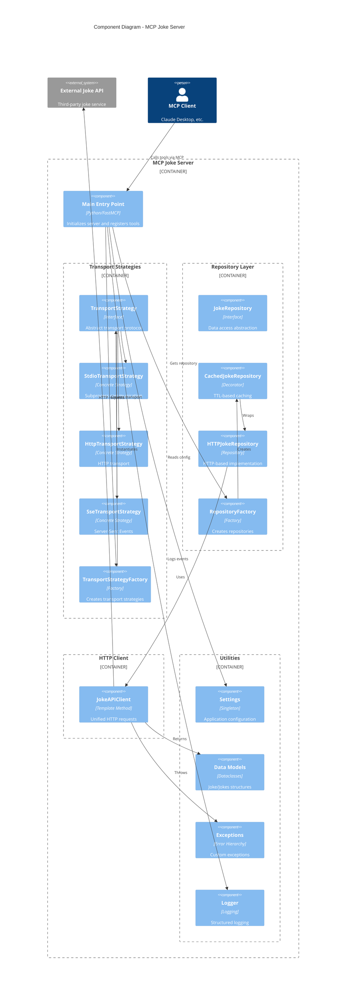
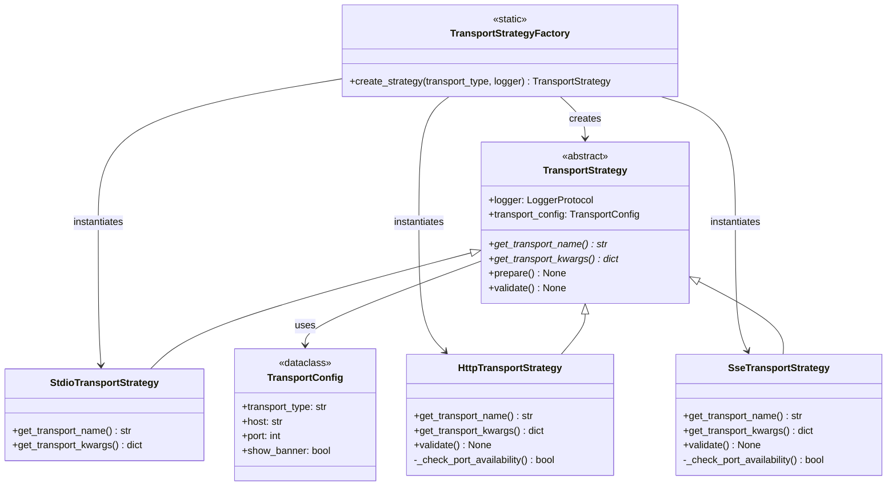
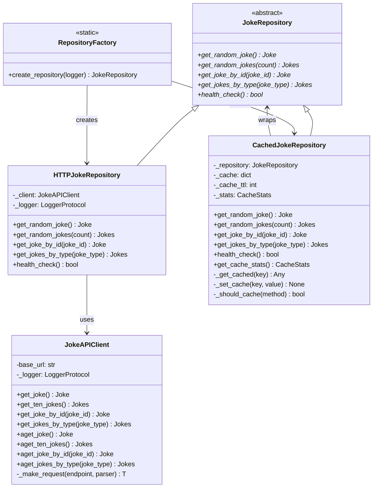
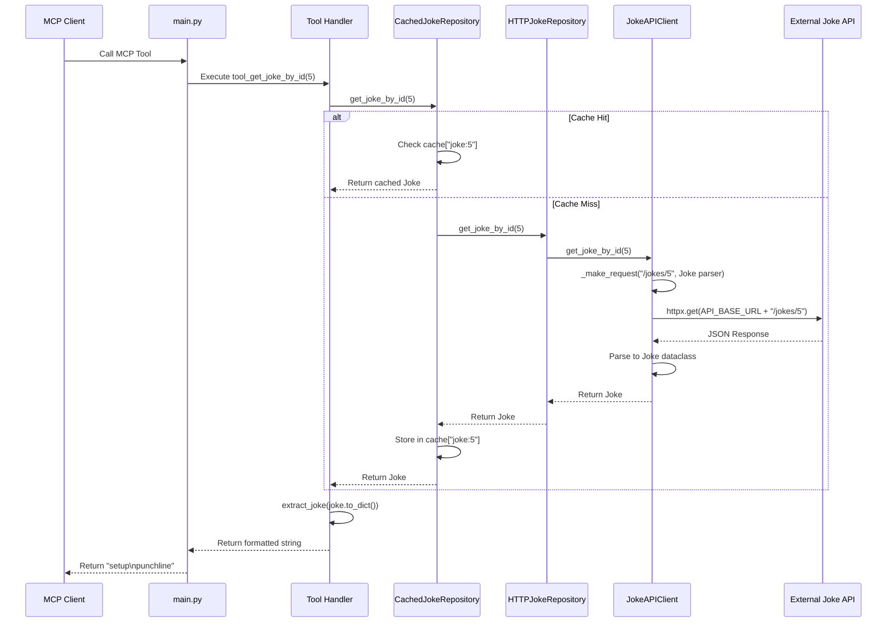
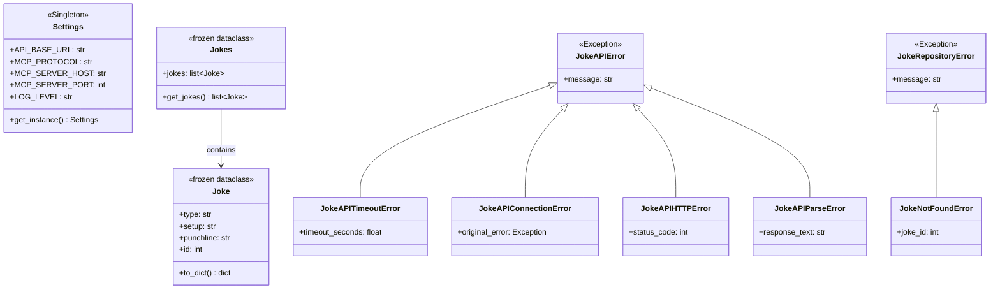
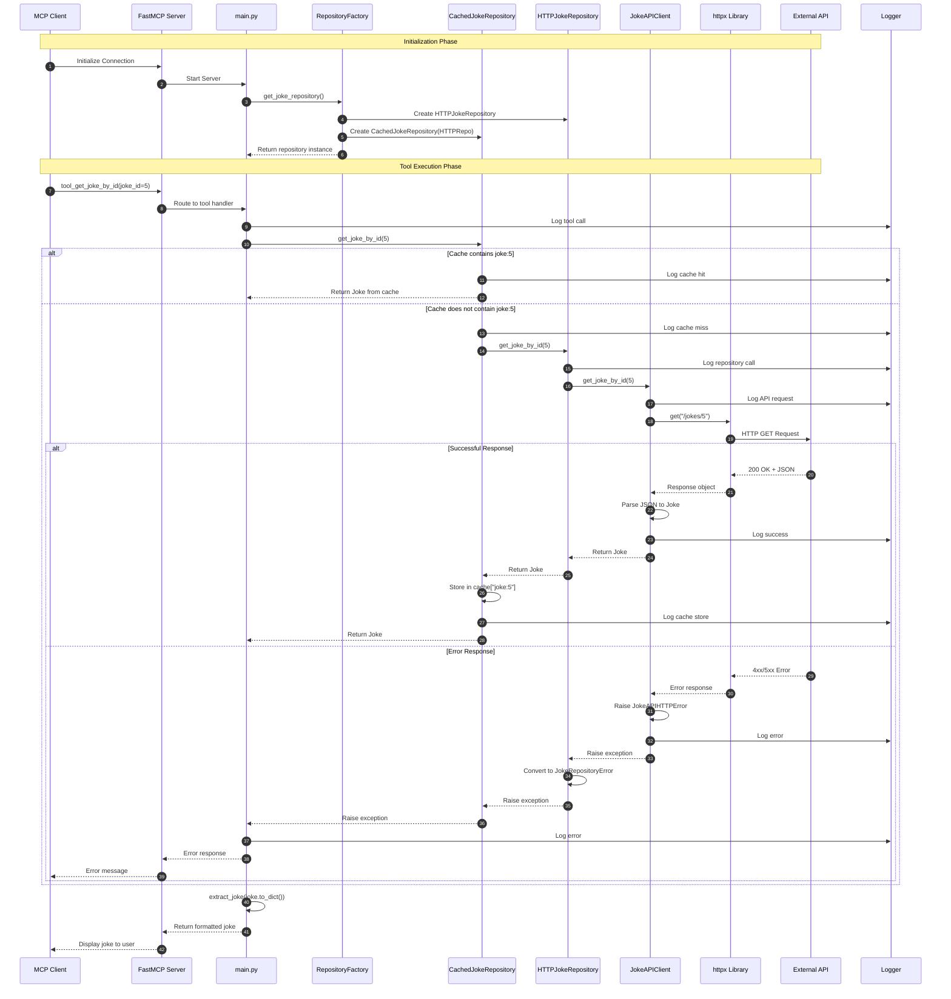
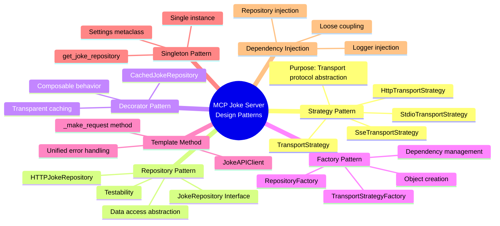

# MCP Joke Server - Architecture Diagrams

This document contains comprehensive architecture diagrams for the MCP Joke Server project using Mermaid notation.

## Table of Contents
1. [High-Level Architecture Overview](#high-level-architecture-overview)
2. [Component Diagram](#component-diagram)
3. [Transport Strategy Pattern](#transport-strategy-pattern)
4. [Repository Pattern Layers](#repository-pattern-layers)
5. [Data Flow Diagram](#data-flow-diagram)
6. [Class Hierarchy](#class-hierarchy)
7. [Sequence Diagram - Tool Execution](#sequence-diagram---tool-execution)

---

## High-Level Architecture Overview

This diagram shows the main architectural layers and their relationships.

---

## Component Diagram

This diagram shows the detailed component structure and their dependencies.

---

## Transport Strategy Pattern

This diagram illustrates the Strategy Pattern implementation for transport protocols.

---

## Repository Pattern Layers

This diagram shows the Repository and Decorator patterns for data access.

---

## Data Flow Diagram

This diagram illustrates the complete data flow from client request to response.

---

## Class Hierarchy

This diagram shows the complete class hierarchy and relationships.

---

## Sequence Diagram - Tool Execution

Complete sequence diagram showing a full tool execution flow with all components.

---

## Design Patterns Summary

---

## Legend

### Diagram Types
- **Graph TB**: Top-Bottom flow diagrams
- **Class Diagram**: UML class relationships
- **Sequence Diagram**: Interaction flows
- **Mind Map**: Conceptual relationships

### Color Coding (High-Level Architecture)
- 🟢 Green: Entry points (main.py)
- 🔵 Blue: Strategy layer (Transport)
- 🟠 Orange: Repository layer
- 🟣 Purple: HTTP client layer
- 🔴 Red: Configuration

### Relationship Symbols
- `-->`: Uses/depends on
- `<|--`: Inherits from/implements
- `*`: Abstract method

---

## Quick Reference

### Main Components
1. **main.py**: FastMCP server entry point with 7 tools
2. **strategies/**: Transport protocol implementations (stdio, HTTP, SSE)
3. **repositories/**: Data access layer with caching
4. **utils/RequestAPIJokes.py**: HTTP client for external API
5. **utils/config.py**: Centralized configuration management
6. **utils/model.py**: Data structures (Joke, Jokes)
7. **utils/exceptions.py**: Custom exception hierarchy

### Key Extension Points
- Add new transport: Extend `TransportStrategy`
- Add new repository: Implement `JokeRepository`
- Customize caching: Modify `CachedJokeRepository`
- Add async tools: Use `aget_*` methods

---

*Generated on 2025-11-15*
