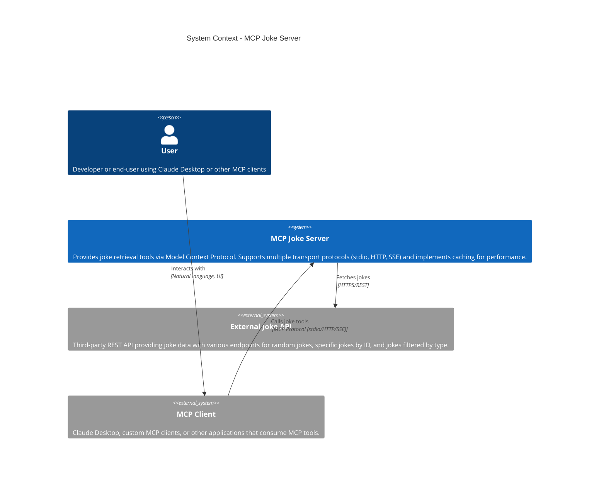
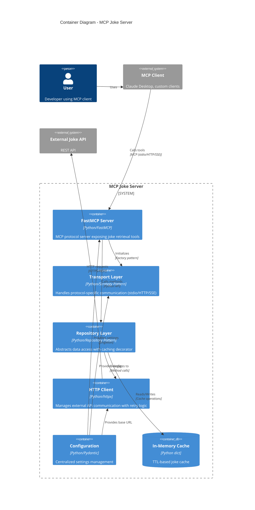
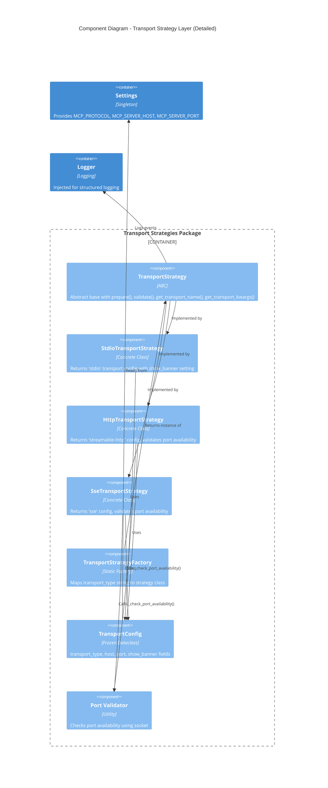
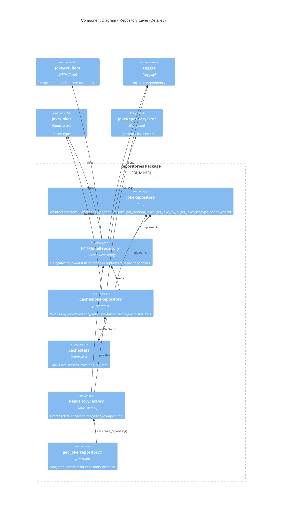
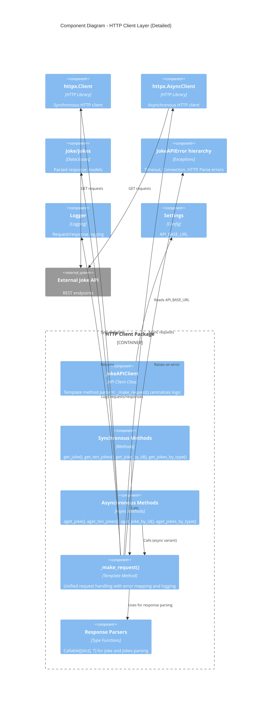
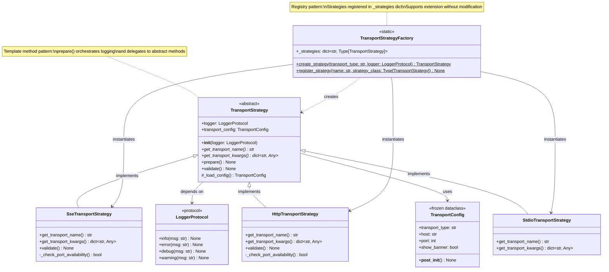
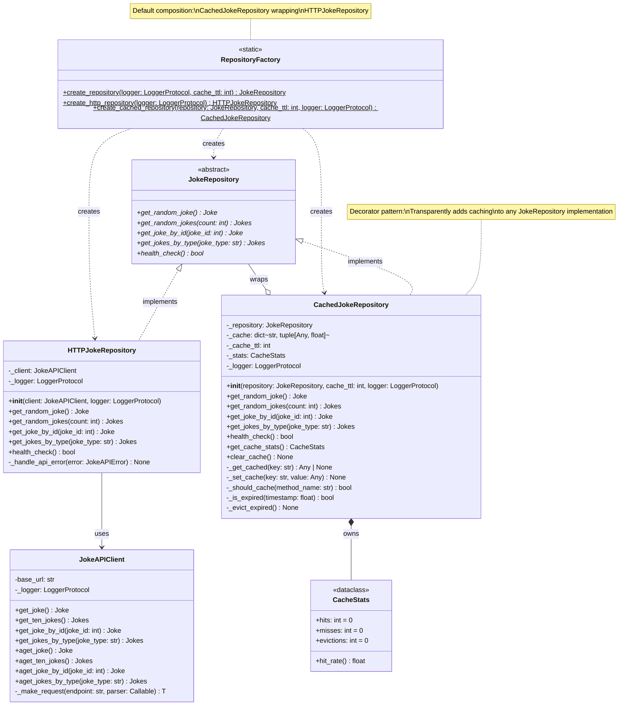
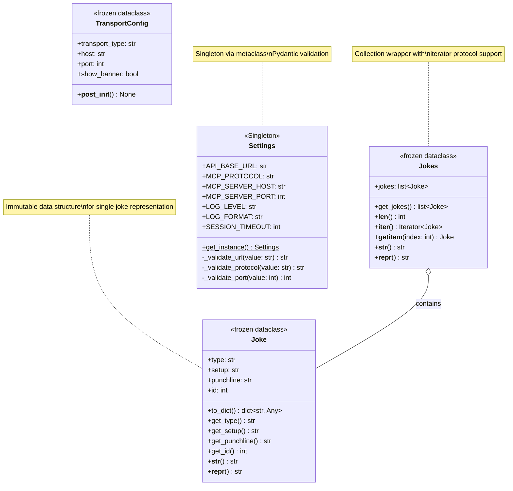
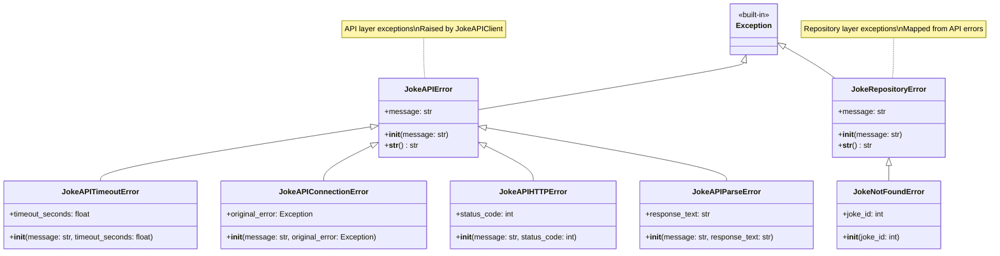

# MCP Joke Server - C4 Architecture Model

This document provides a complete C4 Model architecture documentation for the MCP Joke Server project. The C4 model uses four levels of abstraction: Context, Container, Component, and Code.

## Table of Contents
1. [Level 1: System Context Diagram](#level-1-system-context-diagram)
2. [Level 2: Container Diagram](#level-2-container-diagram)
3. [Level 3: Component Diagram](#level-3-component-diagram)
   - [Transport Strategy Components](#transport-strategy-components)
   - [Repository Components](#repository-components)
   - [HTTP Client Components](#http-client-components)
4. [Level 4: Code Diagrams](#level-4-code-diagrams)
   - [Transport Strategy Classes](#transport-strategy-classes)
   - [Repository Pattern Classes](#repository-pattern-classes)
   - [Data Models](#data-models)
   - [Exception Hierarchy](#exception-hierarchy)

---

## Level 1: System Context Diagram

The highest level view showing the MCP Joke Server system and its interactions with users and external systems.



### System Purpose

**MCP Joke Server** is a Model Context Protocol server that:
- Exposes 7 joke retrieval tools (4 synchronous + 3 asynchronous variants)
- Supports flexible transport protocols for different deployment scenarios
- Implements intelligent caching to reduce external API calls
- Provides structured error handling and logging
- Follows clean architecture principles with separation of concerns

### Key System Characteristics
- **Protocol Support**: stdio (subprocess), HTTP (network), SSE (streaming)
- **Caching Strategy**: TTL-based in-memory cache (5-minute default)
- **API Integration**: REST client with retry logic and error handling
- **Configuration**: Environment-based settings with validation
- **Logging**: Structured logging with Rich console formatting

---

## Level 2: Container Diagram

Shows the high-level technology choices and how containers communicate.



### Container Responsibilities

| Container | Technology | Responsibility |
|-----------|-----------|----------------|
| **FastMCP Server** | Python, FastMCP library | Tool registration, request routing, response formatting |
| **Transport Layer** | Python, Strategy Pattern | Protocol abstraction, connection management, validation |
| **Repository Layer** | Python, Repository + Decorator Pattern | Data access abstraction, caching logic, error mapping |
| **HTTP Client** | Python, httpx | External API communication, request/response handling, retry logic |
| **Configuration** | Pydantic BaseSettings | Environment-based config, validation, singleton access |
| **In-Memory Cache** | Python dict | Temporary storage for deterministic queries, TTL management |

### Inter-Container Communication

1. **MCP Client → FastMCP**: Protocol-specific transport (stdio/HTTP/SSE)
2. **FastMCP → Repository**: Direct Python method calls
3. **Repository → Cache**: Dictionary operations with TTL checking
4. **Repository → HTTP Client**: Method delegation for cache misses
5. **HTTP Client → External API**: HTTPS REST requests
6. **Configuration → All**: Injected settings via singleton pattern

---

## Level 3: Component Diagram

### Main Application Components

```mermaid
C4Component
    title Component Diagram - Main Application Layer

    Container_Boundary(app, "FastMCP Server Application") {
        Component(main, "main.py", "Python Module", "Server initialization, tool registration, dependency wiring")
        Component(tools, "Tool Handlers", "Python Functions", "7 MCP tools: get_joke, get_ten_jokes, get_joke_by_id, get_jokes_by_type + async variants")
        Component(extractors, "Data Extractors", "Utility Functions", "extract_joke, extract_jokes - format data for display")
    }

    Container_Boundary(transport_container, "Transport Layer") {
        Component(tStrategy, "TransportStrategy", "Abstract Base", "Interface for transport implementations")
        Component(tFactory, "TransportStrategyFactory", "Factory", "Creates transport instances")
        Component(tConfig, "TransportConfig", "Dataclass", "Immutable transport configuration")
        Component(stdio, "StdioTransportStrategy", "Concrete Strategy", "Subprocess transport")
        Component(http, "HttpTransportStrategy", "Concrete Strategy", "HTTP network transport")
        Component(sse, "SseTransportStrategy", "Concrete Strategy", "Server-Sent Events transport")
    }

    Container_Boundary(repo_container, "Repository Layer") {
        Component(jRepo, "JokeRepository", "Abstract Base", "Data access interface")
        Component(rFactory, "RepositoryFactory", "Factory", "Creates repository instances")
        Component(httpRepo, "HTTPJokeRepository", "Concrete Repository", "HTTP-based implementation")
        Component(cachedRepo, "CachedJokeRepository", "Decorator", "Adds caching behavior")
    }

    Container_Boundary(client_container, "HTTP Client Layer") {
        Component(apiClient, "JokeAPIClient", "API Client", "Template method pattern for API calls")
        Component(httpxLib, "httpx", "External Library", "HTTP client library")
    }

    Container_Boundary(utils_container, "Utilities & Configuration") {
        Component(settings, "Settings", "Singleton", "Application configuration")
        Component(models, "Data Models", "Dataclasses", "Joke, Jokes structures")
        Component(exceptions, "Exceptions", "Error Classes", "Custom exception hierarchy")
        Component(logger, "Logger", "Logging Infrastructure", "Structured logging with Rich")
        Component(constants, "Constants", "Module", "JOKE_TYPES, URLs")
    }

    System_Ext(external, "External Joke API", "REST API")
    Person(client, "MCP Client")

    Rel(client, main, "Calls via MCP")
    Rel(main, tools, "Routes requests")
    Rel(main, tFactory, "Creates transport")
    Rel(tFactory, tStrategy, "Instantiates")
    Rel(tStrategy, stdio, "")
    Rel(tStrategy, http, "")
    Rel(tStrategy, sse, "")
    Rel(stdio, tConfig, "Uses")
    Rel(http, tConfig, "Uses")
    Rel(sse, tConfig, "Uses")

    Rel(tools, rFactory, "Gets repository")
    Rel(rFactory, cachedRepo, "Creates")
    Rel(cachedRepo, jRepo, "Implements")
    Rel(cachedRepo, httpRepo, "Wraps")
    Rel(httpRepo, jRepo, "Implements")
    Rel(tools, extractors, "Formats data")

    Rel(httpRepo, apiClient, "Uses")
    Rel(apiClient, httpxLib, "HTTP calls")
    Rel(httpxLib, external, "HTTPS requests")

    Rel(main, settings, "Reads config")
    Rel(tConfig, settings, "Reads config")
    Rel(apiClient, settings, "Reads base URL")
    Rel(apiClient, models, "Returns")
    Rel(apiClient, exceptions, "Raises")
    Rel(main, logger, "Logs")
    Rel(httpRepo, logger, "Logs")
    Rel(apiClient, logger, "Logs")
    Rel(tools, constants, "Validates types")

    UpdateLayoutConfig($c4ShapeInRow="2", $c4BoundaryInRow="1")
```



### Transport Strategy Components



**Key Design Decisions:**
- **Strategy Pattern**: Enables runtime transport selection without changing core logic
- **Validation**: HTTP and SSE strategies validate port availability before startup
- **Immutability**: TransportConfig is frozen to prevent accidental modification
- **Factory**: Centralizes strategy creation with error handling for unknown types

### Repository Components



**Key Design Decisions:**
- **Repository Pattern**: Abstracts data source, enabling easy mocking in tests
- **Decorator Pattern**: CachedJokeRepository transparently adds caching without changing interface
- **Smart Caching**: Only caches deterministic queries (by_id, by_type), not random jokes
- **Statistics**: Cache maintains metrics for observability
- **Error Mapping**: HTTPJokeRepository converts API exceptions to repository exceptions

### HTTP Client Components



**Key Design Decisions:**
- **Template Method**: `_make_request()` eliminates code duplication across 8 methods
- **Dual Mode**: Both sync and async variants for different use cases
- **Error Handling**: Comprehensive exception mapping (timeout, connection, HTTP, parse)
- **Type Safety**: Generic type parameter T with parser functions
- **Logging**: Structured logging of all requests and responses

---

## Level 4: Code Diagrams

### Transport Strategy Classes



**Implementation Details:**

```python
# Abstract method examples
class TransportStrategy(ABC):
    @abstractmethod
    def get_transport_name(self) -> str:
        """Returns the transport protocol name"""
        pass

    @abstractmethod
    def get_transport_kwargs(self) -> dict[str, Any]:
        """Returns FastMCP transport configuration"""
        pass

# Concrete implementation example
class HttpTransportStrategy(TransportStrategy):
    def get_transport_name(self) -> str:
        return "streamable-http"

    def get_transport_kwargs(self) -> dict[str, Any]:
        return {
            "transport": "streamable-http",
            "http_server_host": self.transport_config.host,
            "http_server_port": self.transport_config.port
        }
```

### Repository Pattern Classes



**Cache Key Strategy:**
```python
# Deterministic queries (cached)
"joke:{joke_id}"           # get_joke_by_id(5) → "joke:5"
"jokes:type:{joke_type}"   # get_jokes_by_type("general") → "jokes:type:general"

# Non-deterministic queries (not cached)
get_random_joke()          # Different result each call
get_random_jokes(count)    # Different results each call
```

### Data Models



### Exception Hierarchy



**Exception Flow:**
```
External API Error
    ↓
JokeAPIClient catches
    ↓
Raises JokeAPI*Error (specific type)
    ↓
HTTPJokeRepository catches
    ↓
Maps to JokeRepositoryError
    ↓
Propagates to Tool Handler
    ↓
Returns error to MCP Client
```

---

## C4 Model Summary

### Level 1: Context
- **Focus**: System boundary and external interactions
- **Audience**: Everyone (technical and non-technical)
- **Shows**: MCP Joke Server, users, external systems

### Level 2: Container
- **Focus**: High-level technology choices
- **Audience**: Technical people (developers, architects)
- **Shows**: FastMCP server, transport layer, repository, HTTP client, cache

### Level 3: Component
- **Focus**: Internal structure of containers
- **Audience**: Developers and architects
- **Shows**: Strategy factories, repository decorators, API clients, utilities

### Level 4: Code
- **Focus**: Implementation details
- **Audience**: Developers
- **Shows**: Class diagrams, method signatures, relationships

---

## Design Patterns by C4 Level

| Pattern | C4 Level | Location | Purpose |
|---------|----------|----------|---------|
| **Strategy** | 3 & 4 | Transport Layer | Runtime protocol selection |
| **Repository** | 2 & 3 & 4 | Data Access | Abstract data source |
| **Decorator** | 3 & 4 | CachedJokeRepository | Add caching behavior |
| **Factory** | 3 & 4 | Multiple factories | Object creation |
| **Template Method** | 4 | JokeAPIClient | Unified request handling |
| **Singleton** | 2 & 4 | Settings, repository getter | Single instance |
| **Dependency Injection** | 2 & 3 | Throughout | Loose coupling |

---

## Navigation Guide

### For Architects
1. Start with **Level 1** for system overview
2. Review **Level 2** for technology choices
3. Examine **Level 3** for component interactions

### For Developers
1. Review **Level 2** for container responsibilities
2. Dive into **Level 3** for component details
3. Study **Level 4** for implementation specifics

### For New Team Members
1. **Level 1**: Understand the system purpose
2. **Level 2**: Learn the technology stack
3. **Level 3**: Explore component structure
4. **Level 4**: Study code patterns and conventions

---

## Extension Points by Level

### Container Level (L2)
- Add new transport container (e.g., WebSocket)
- Replace cache container (e.g., Redis)
- Add monitoring container

### Component Level (L3)
- New transport strategy (extend TransportStrategy)
- New repository implementation (implement JokeRepository)
- Custom cache policy (extend CachedJokeRepository)

### Code Level (L4)
- Add new API endpoints (extend JokeAPIClient)
- Custom exception types (extend JokeAPIError)
- Additional data models (new dataclasses)

---

## References

- **C4 Model**: https://c4model.com/
- **Mermaid C4 Diagrams**: https://mermaid.js.org/syntax/c4.html
- **FastMCP Documentation**: https://github.com/jlowin/fastmcp
- **Repository Pattern**: https://martinfowler.com/eaaCatalog/repository.html
- **Strategy Pattern**: https://refactoring.guru/design-patterns/strategy

---

*Generated on 2025-11-15*
*MCP Joke Server - C4 Architecture Model v1.0*
